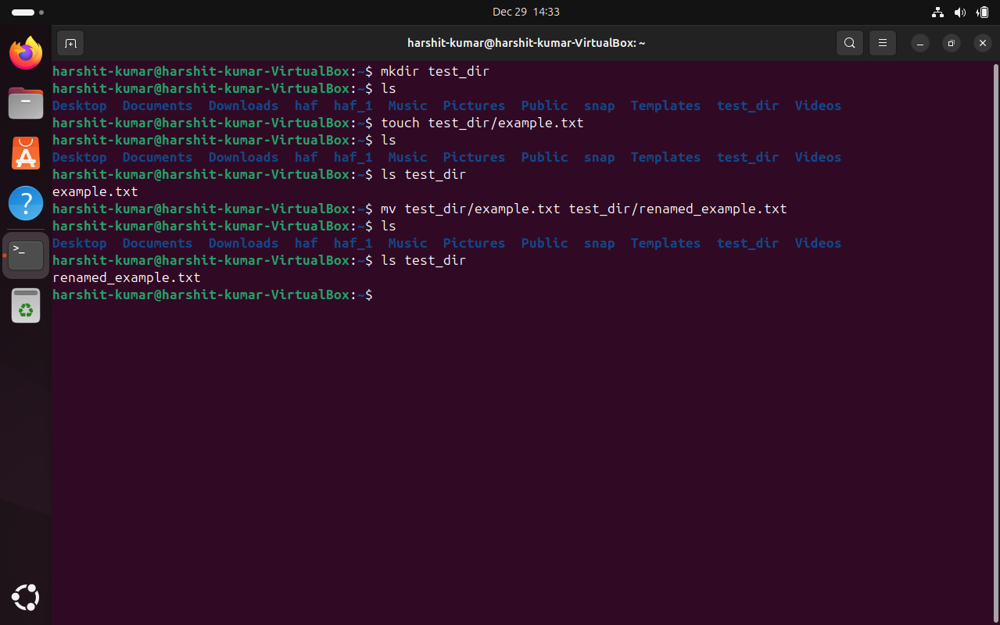
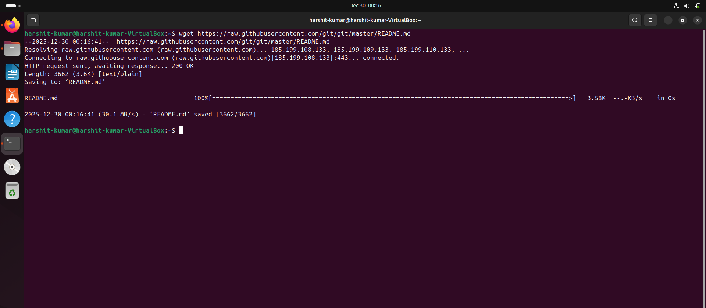
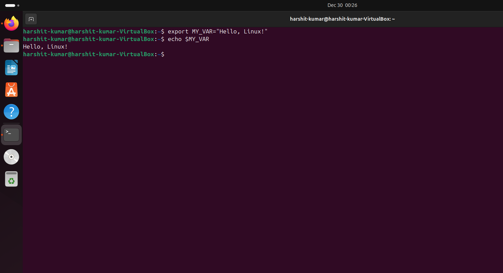

Linux Basic Commands Practical Assignment

Name: Harshit Kumar

--------------------------------------------------

1. Creating and Renaming Files/Directories

Commands used:
mkdir test_dir
touch test_dir/example.txt
mv test_dir/example.txt test_dir/renamed_example.txt

Screenshot:

--------------------------------------------------

2. Viewing File Contents

Commands used:
cat /etc/passwd
head -n 5 /etc/passwd
tail -n 5 /etc/passwd

Screenshots:

--------------------------------------------------

3. Searching for Patterns

Command used:
grep root /etc/passwd

Screenshot:

--------------------------------------------------

4. Zipping and Unzipping

Commands used:
zip -r test_dir.zip test_dir
unzip test_dir.zip -d unzipped_dir

Screenshot:

--------------------------------------------------

5. Downloading Files

Command used:
wget https://www.gnu.org/licenses/gpl-3.0.txt

Screenshot:

--------------------------------------------------

6. Changing Permissions

Commands used:
touch secure.txt
chmod 444 secure.txt
ls -l secure.txt

Screenshot:

--------------------------------------------------

7. Working with Environment Variables

Commands used:
export MY_VAR="Hello, Linux!"
echo $MY_VAR

Screenshot:

--------------------------------------------------

End of Assignment
